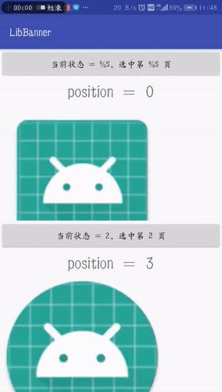

# android-lib-banner
Android 轮播图 Banner，只提供轮播本身的功能，其他包括轮播指示器，轮播内容等，烦请自定义

## 依赖
这个还在摸索中，望大神指教，尽快弄成以下形式：

```
dependencies {
    implementation '***:x.x.x'
}
```

## 外围使用：
[sample - MainActivity](./sample/src/main/java/com/csp/sample/banner/MainActivity.java)

``` java
// 轮播数据：10 条
List<Integer> resIds = new ArrayList<>();
resIds.add(R.mipmap.ic_launcher);
resIds.add(R.mipmap.ic_launcher_round);
resIds.add(R.mipmap.ic_launcher);
resIds.add(R.mipmap.ic_launcher_round);
resIds.add(R.mipmap.ic_launcher);
resIds.add(R.mipmap.ic_launcher_round);
resIds.add(R.mipmap.ic_launcher);
resIds.add(R.mipmap.ic_launcher_round);
resIds.add(R.mipmap.ic_launcher);
resIds.add(R.mipmap.ic_launcher_round);

// 轮播
ViewPager.OnPageChangeListener listener = new SampleListener(txt);
final SamplePagerAdapter adapter = new SamplePagerAdapter(context, resIds);
vpgBanner.setAdapter(new BannerPagerAdapter(adapter));
vpgBanner.addOnPageChangeListener(new BannerOnPageChangeListener(vpgBanner, listener));
vpgBanner.setCurrentItem(1);

// 自动轮播
ViewPager.OnPageChangeListener listener02 = new SampleListener(txtAuto);
BannerTimeOnPageChangeListener bannerListener = new BannerTimeOnPageChangeListener(vpgBannerAuto, listener02);
bannerListener.setIntervalTime(5000); // 自动轮播间隔时间
bannerListener.startCarousel(); // 开始自动轮播

// final SamplePagerAdapter adapter = new SamplePagerAdapter(context, resIds);
vpgBannerAuto.setAdapter(new BannerPagerAdapter(adapter));
vpgBannerAuto.addOnPageChangeListener(bannerListener);
vpgBannerAuto.setCurrentItem(1);
```

## Sample


上面那个 ViewPager 是轮播，但不自动，需手势滑动。底下那个 ViewPager 是自动轮播

## 原理

自己看源码吧，就 3 个类，总共不到 200 行的代码。

方案简述：在原适配器的基础上额外扩大 2 个 item，追加在头尾，以此来完成轮播的头尾滑动（看不明白这句话的话，请看源码，滑稽）

[BannerPagerAdapter.java](./lib-banner/src/main/java/com/csp/banner/BannerPagerAdapter.java)

必要：是轮播的适配器，采用装饰者模式。

[BannerOnPageChangeListener.java](./lib-banner/src/main/java/com/csp/banner/BannerOnPageChangeListener.java)

必要：是轮播的滚动监听器，采用装饰者模式。

[BannerOnPageChangeListener.java](./lib-banner/src/main/java/com/csp/banner/BannerOnPageChangeListener.java)

非必要：需要自动轮播时，才使用的滚动监听器，采用装饰者模式。

